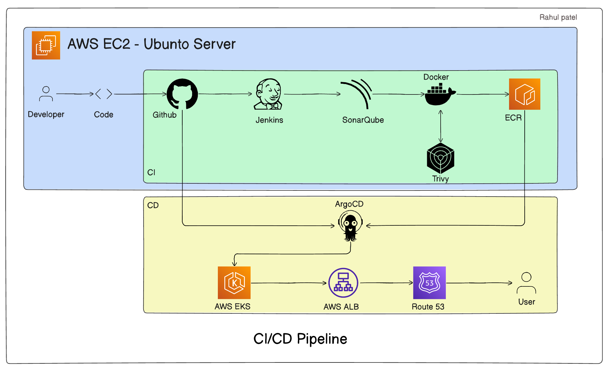
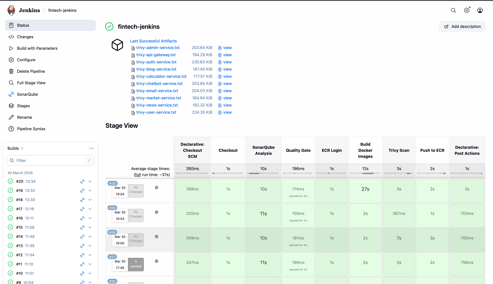
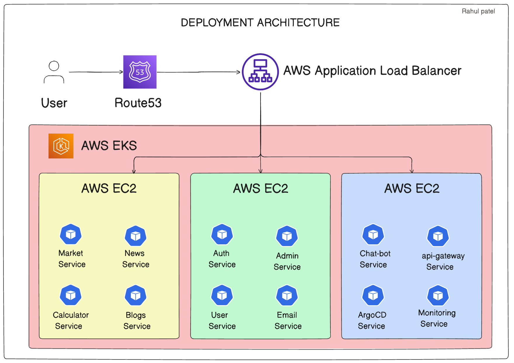
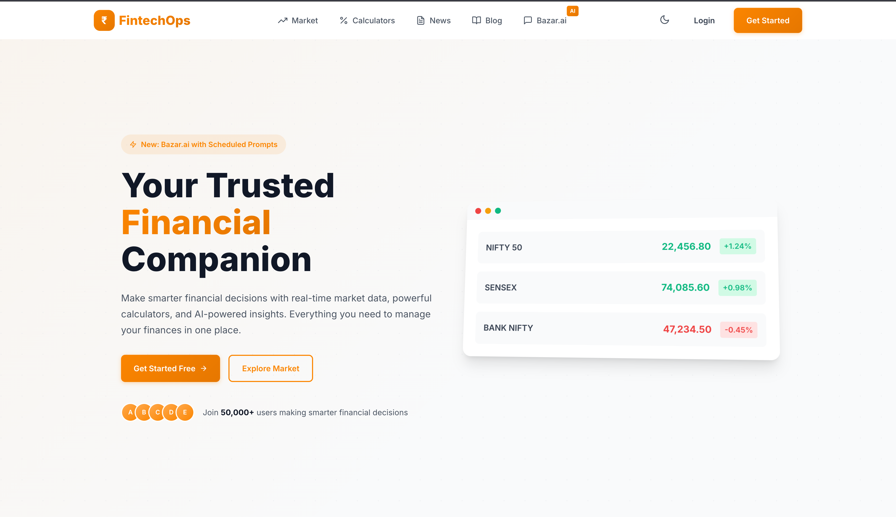
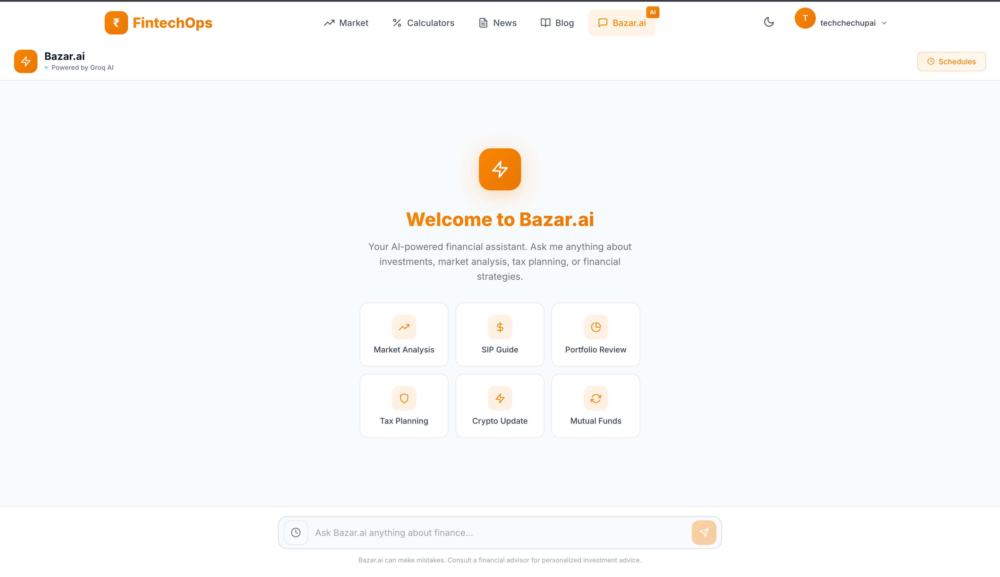
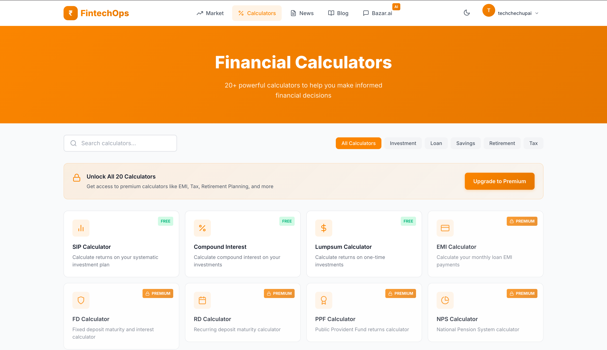

# FintechOps - Financial Market Data Platform

A comprehensive microservices-based fintech application providing market data, financial calculators, news, and AI-powered insights.

## 🏗️ Architecture

```
┌─────────────────────────────────────────────────────────────────────────────┐
│                              FintechOps Platform                             │
├─────────────────────────────────────────────────────────────────────────────┤
│                                                                              │
│   ┌─────────────┐    ┌─────────────┐    ┌─────────────┐    ┌─────────────┐ │
│   │   Route53   │────│     ALB     │────│    EKS      │────│    ECR      │ │
│   │    (DNS)    │    │ (Load Bal.) │    │ (K8s Cluster)│   │  (Images)   │ │
│   └─────────────┘    └─────────────┘    └─────────────┘    └─────────────┘ │
│                                                                              │
│   ┌──────────────────────────────────────────────────────────────────────┐  │
│   │                        Microservices Layer                            │  │
│   │                                                                        │  │
│   │   ┌──────────┐ ┌──────────┐ ┌──────────┐ ┌──────────┐ ┌──────────┐  │  │
│   │   │   Auth   │ │  User    │ │ Market   │ │  News    │ │  Blog    │  │  │
│   │   │ Service  │ │ Service  │ │ Service  │ │ Service  │ │ Service  │  │  │
│   │   └──────────┘ └──────────┘ └──────────┘ └──────────┘ └──────────┘  │  │
│   │                                                                        │  │
│   │   ┌──────────┐ ┌──────────┐ ┌──────────┐ ┌──────────┐               │  │
│   │   │Calculator│ │ Chatbot  │ │  Email   │ │  Admin   │               │  │
│   │   │ Service  │ │ (Groq)   │ │ Service  │ │ Service  │               │  │
│   │   └──────────┘ └──────────┘ └──────────┘ └──────────┘               │  │
│   └──────────────────────────────────────────────────────────────────────┘  │
│                                                                              │
│   ┌──────────────────────────────────────────────────────────────────────┐  │
│   │                         Data Layer                                    │  │
│   │   ┌─────────────────┐              ┌─────────────────┐               │  │
│   │   │     MongoDB     │              │   PostgreSQL    │               │  │
│   │   │ (User Sessions, │              │  (User Data,    │               │  │
│   │   │  Blogs, Chats)  │              │  Transactions)  │               │  │
│   │   └─────────────────┘              └─────────────────┘               │  │
│   └──────────────────────────────────────────────────────────────────────┘  │
│                                                                              │
│   ┌──────────────────────────────────────────────────────────────────────┐  │
│   │                      Monitoring & Security                            │  │
│   │   ┌──────────┐ ┌──────────┐ ┌──────────┐ ┌──────────┐               │  │
│   │   │Prometheus│ │ Grafana  │ │ Cognito  │ │   ACM    │               │  │
│   │   └──────────┘ └──────────┘ └──────────┘ └──────────┘               │  │
│   └──────────────────────────────────────────────────────────────────────┘  │
│                                                                              │
└─────────────────────────────────────────────────────────────────────────────┘
```







## 🚀 Tech Stack

### Frontend
- React.js 18+
- CSS3 (Pure CSS, no frameworks)
- Responsive Design

### Backend (Microservices)
- Node.js + Express
- REST APIs

### Databases
- MongoDB (User sessions, blogs, chat history)
- PostgreSQL (User data, transactions, market data)

### AWS Services
- **Authentication**: AWS Cognito
- **Load Balancing**: AWS ALB
- **Container Orchestration**: AWS EKS
- **DNS**: AWS Route53
- **SSL/TLS**: AWS ACM
- **Container Registry**: AWS ECR
- **Notifications**: AWS SNS/SES

### CI/CD Pipeline
- GitHub → Jenkins → SonarQube → Docker → Trivy → ECR → ArgoCD

### Monitoring
- Prometheus
- Grafana

## 📁 Project Structure

```
fintech/
├── frontend/                    # React Application
│   ├── src/
│   │   ├── components/         # Reusable components
│   │   ├── pages/              # Page components
│   │   ├── services/           # API services
│   │   ├── context/            # React context
│   │   ├── hooks/              # Custom hooks
│   │   └── utils/              # Utility functions
│   └── public/
│
├── services/                    # Backend Microservices
│   ├── auth-service/           # Authentication service
│   ├── user-service/           # User management
│   ├── market-service/         # Market data
│   ├── news-service/           # News aggregation
│   ├── blog-service/           # Blog management
│   ├── calculator-service/     # Financial calculators
│   ├── chatbot-service/        # Groq AI chatbot
│   ├── email-service/          # Email notifications
│   ├── admin-service/          # Admin operations
│   └── api-gateway/            # API Gateway
│
├── databases/                   # Database schemas & migrations
│   ├── mongodb/
│   └── postgresql/
│
├── infrastructure/              # IaC & DevOps
│   ├── kubernetes/             # K8s manifests
│   ├── terraform/              # Terraform configs
│   ├── jenkins/                # Jenkins pipelines
│   └── argocd/                 # ArgoCD configs
│
├── monitoring/                  # Monitoring configs
│   ├── prometheus/
│   └── grafana/
│
└── docker/                      # Docker configurations
```

## 🎨 Theme

- **Primary**: #fb8500 (Orange)
- **Light**: #ffffff (White)
- **Dark**: #000000 (Black)
- **Professional, Clean UI**
- **Fully Responsive**
- **Animated with hover effects**

## 🚀 Quick Start

### Prerequisites
- Node.js 18+
- Docker & Docker Compose
- MongoDB
- PostgreSQL

### Local Development

1. Clone the repository:
```bash
git clone https://github.com/yourusername/fintechops.git
cd fintechops
```

2. Start databases:
```bash
docker-compose up -d mongodb postgresql
```

3. Start backend services:
```bash
cd services
npm run start:all
```

4. Start frontend:
```bash
cd frontend
npm install
npm start
```

## 📊 Features

1. **User Authentication** - AWS Cognito integration
2. **Financial Calculators** - 20 calculators (3 free, rest premium)
3. **Market Data** - Real-time stock data, indices
4. **News Service** - India & Global financial news
5. **Blog Platform** - Financial insights & articles
6. **AI Chatbot (Bazar.ai)** - Groq-powered prompt scheduling
7. **Email Notifications** - AWS SNS/SES integration
8. **Admin Dashboard** - User & content management

## 📝 License

MIT License
